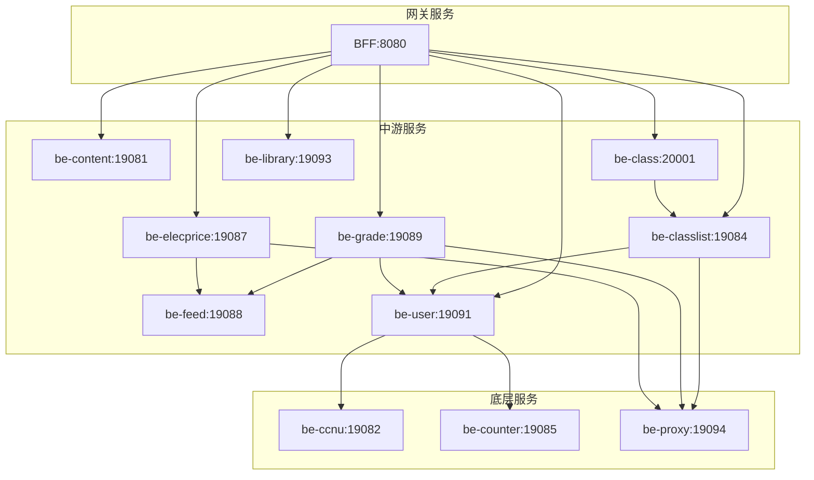

# 华师匣子后端

华师匣子后端是一个基于 Go 的微服务架构项目，为华师匣子应用提供后端支持。

## 项目特性

- **微服务架构**：12 个独立服务，解耦设计
- **服务注册与发现**：基于 etcd 的服务治理
- **日志追踪**：集成 OpenTelemetry，支持分布式追踪
- **多协议支持**：同时支持 gRPC 和 HTTP
- **消息队列**：Kafka 实现异步消息处理
- **搜索能力**：Elasticsearch 提供全文搜索支持

## 技术栈

| 组件 | 版本 | 用途 |
|------|------|------|
| Go | 1.26+ | 开发语言 |
| etcd | latest | 服务注册与发现 |
| MySQL | latest | 数据存储 |
| Redis | latest | 缓存与分布式锁 |
| Kafka | latest | 消息队列 |
| Elasticsearch | 7.17.23 | 搜索引擎 |

## 目录结构

```
ccnubox-be/
├── bff/                  # BFF 层，聚合后端服务
├── common/               # 公共定义，protobuf 文件
├── be-content/           # 内容服务
├── be-ccnu/              # CCNU 一站式登录
├── be-class/             # 课程服务（统一架构版本）
├── be-classlist/         # 课表服务
├── be-counter/           # 核心用户判断
├── be-elecprice/         # 电费服务
├── be-feed/              # 消息推送服务
├── be-grade/             # 成绩服务
├── be-user/              # 用户服务
├── be-proxy/             # IP 代理池
└── be-library/           # 图书馆服务
```

## 服务说明

| 服务 | 端口 | 说明 |
|------|------|------|
| bff | 8080 | BFF 层，聚合服务给前端 |
| be-content | 19081 | 校历、部门、信息汇总、banner |
| be-ccnu | 19082 | 一站式登录服务 |
| be-class | 18000/20001 | 蹭课、空闲教室查询 |
| be-classlist | 19084 | 课表管理 |
| be-counter | 19085 | 核心用户判断 |
| be-elecprice | 19087 | 电费查询 |
| be-feed | 19088 | 消息推送 |
| be-grade | 19089 | 成绩查询 |
| be-user | 19091 | 用户服务，提供 cookie |
| be-library | 19093 | 图书馆服务 |
| be-proxy | 19094 | IP 代理池 |

## 快速开始

### 环境要求

- Go 1.26+
- Docker & Docker Compose

### 部署与配置

生产环境由 GitHub Actions 构建和发布服务镜像，并在远程服务器上通过 Docker Compose 更新服务。运行时配置统一由 Nacos 管理；本地调试请参考各服务目录中的 README 和配置示例。

## 架构图



## 配置说明

服务运行配置按服务维护，基础设施配置示例由根目录统一维护：

| 文件 | 说明 |
|------|------|
| `<服务>/config/config-example.yaml` | 各服务运行配置示例 |
| `/config-infra-example.yaml` | 所有服务共用的基础组件配置示例 |

### 配置示例（config-example.yaml）

```yaml
env: "prod"

server:
  name: "服务名"
  grpc:
    addr: "0.0.0.0:端口"
    timeout: 10s

data:
  database:
    source: "用户名:密码@tcp(主机:端口)/数据库?charset=utf8mb4&parseTime=True&loc=Local"
  redis:
    addr: "主机:6379"
    password: "密码"
  kafka:
    brokers:
      - "主机:9092"

registry:
  etcd:
    addr: "主机:2379"
    username: "用户名"
    password: "密码"

log:
  path: "/logs/app.log"
  maxSize: 100
  maxBackups: 7
  maxAge: 30
  compress: 1
```

## 开发指南

### 添加新服务

1. 在根目录创建服务目录
2. 编写 Dockerfile（参考现有服务）
3. 添加服务自己的 config-example.yaml；基础设施配置沿用根目录 config-infra-example.yaml
4. 将服务加入 GitHub Actions 的构建与部署矩阵
5. 在 Nacos 中添加对应的运行时配置
6. 更新本 README 的服务说明

### 本地调试

```bash
# 进入服务目录
cd be-class

# 下载依赖
go mod tidy

# 运行服务
go run .
```

## API 文档

API 文档位于 [bff/docs/](bff/docs/)

## 脚本说明

| 脚本 | 说明 |
|------|------|
| `build-{service}.sh` | 构建单个服务镜像 |
| `build-all.sh` | 构建所有服务镜像 |
| `sync-config.sh` | 同步配置到部署环境 |

## 常见问题

**Q: 服务启动失败怎么办？**
A: 检查 etcd、MySQL、Redis 是否正常运行，确保配置正确。

**Q: 如何查看日志？**
A: 日志挂载在 `/logs` 目录，容器内查看：`docker exec -it <container> tail -f /logs/app.log`

**Q: 如何添加新的 API？**
A: 在 common/ 目录下修改 protobuf 定义，重新生成代码后更新对应服务。
